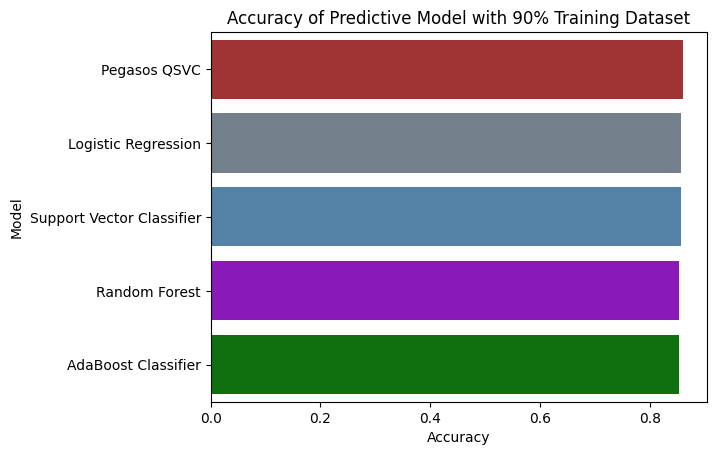
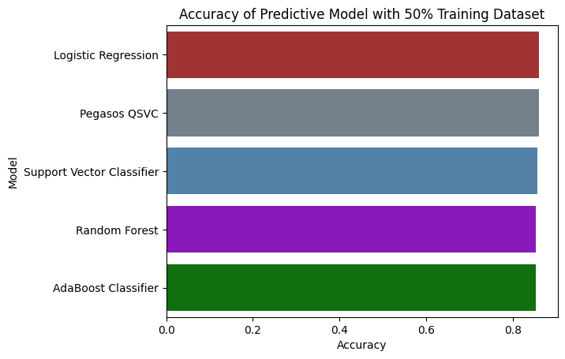

# Glioma_Prediction

### Prerequisites

Make sure you have Python 3.11 installed on your system.

### 1. Cloning the Repository

Clone the repository using the following command:

```bash
git clone https://github.com/enggabhishek/Glioma_Prediction.git
```

### 2. Setting up a Virtual Environment

#### Windows

```bash
# Create a virtual environment
python -m venv venv

# Activate the virtual environment
venv\Scripts\activate
```

#### macOS/Linux

```bash
# Create a virtual environment
python3.11 -m venv venv

# Activate the virtual environment
source venv/bin/activate
```

### 3. Installing Requirements

Install the project dependencies using pip:

```bash
pip install -r requirements.txt
```

## Evaluating the Models

1. ### Logistic Regression:
    - Accuracy: Around 85.7% to 86.1%
    - Confusion Matrix shows stable performance with minimal variation.
    - AUC: Highest at 0.8707 (50% training data), indicating good classification performance.

2. ### Random Forest:
    - Accuracy: Around 85.3%
    - Confusion Matrix has consistent values across different training data percentages.
    - AUC: Around 0.8626, slightly lower than Logistic Regression and Pegasos QSVC.

3. ### AdaBoost Classifier:
    - Accuracy: Around 85.3%
    - Confusion Matrix: Similar results to Random Forest.
    - AUC: Slightly lower than Logistic Regression, around 0.8589 to 0.8626.

4. ### Support Vector Classifier:
    - Accuracy: Around 85.7%
    - Confusion Matrix: Stable with similar values as Logistic Regression.
    - AUC: Around 0.8660, close to Logistic Regression but slightly lower than Pegasos QSVC.

5. ### Pegasos QSVC:
    - Accuracy: Around 86.1%
    - Confusion Matrix: Shows slightly fewer errors in classification compared to other models.
    - AUC: Slightly higher at 0.8671, indicating a robust classification performance.








Based on all the conditions (accuracy, confusion matrix, and AUC), Pegasos QSVC appears to have a slight edge over the other models:

Highest Accuracy (up to 86.1%).
Best AUC among the models (0.8671).
Confusion Matrix shows good classification consistency.
Thus, Pegasos QSVC is the better-performing model overall across all the provided conditions.
