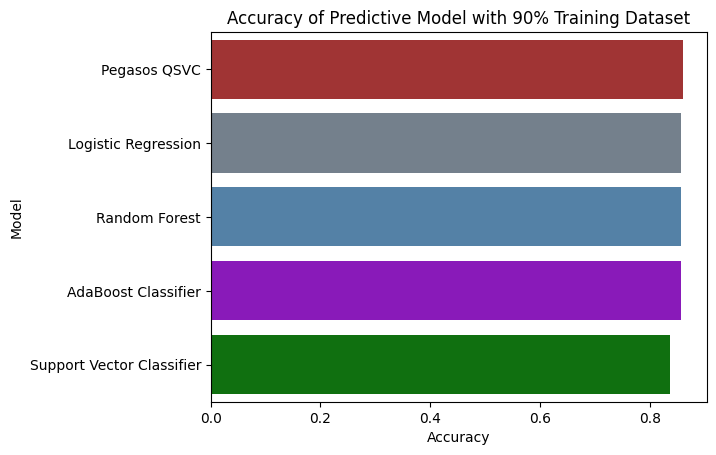
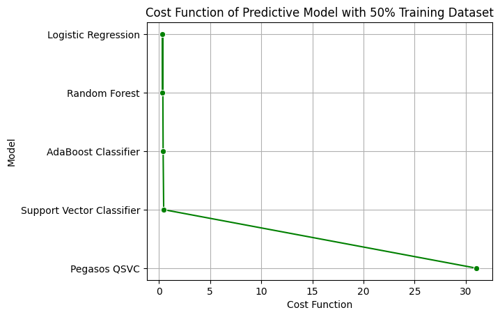

# Glioma_Prediction

### Prerequisites

Make sure you have Python 3.11 installed on your system.

### 1. Cloning the Repository

Clone the repository using the following command:

```bash
git clone https://github.com/enggabhishek/Glioma_Prediction.git
```

### 2. Setting up a Virtual Environment

#### Windows

```bash
# Create a virtual environment
python -m venv venv

# Activate the virtual environment
venv\Scripts\activate
```

#### macOS/Linux

```bash
# Create a virtual environment
python3.11 -m venv venv

# Activate the virtual environment
source venv/bin/activate
```

### 3. Installing Requirements

Install the project dependencies using pip:

```bash
pip install -r requirements.txt
```

## Evaluating the Models

1. ### Logistic Regression:
    - Accuracy: ~86% (both 90.0% and 50.0% classes)
    - Log Loss: 0.366 (90.0% class), 0.369 (50.0% class)

2. ### Random Forest:
    - Accuracy: ~86% (both 90.0% and 50.0% classes)
    - Log Loss: 0.352 (90.0% class), 0.358 (50.0% class)

3. ### AdaBoost Classifier:
    - Accuracy: ~86% (both 90.0% and 50.0% classes)
    - Log Loss: 0.407 (90.0% class), 0.421 (50.0% class)

4. ### Support Vector Classifier:
    - Accuracy: ~84% (both 90.0% and 50.0% classes)
    - Log Loss: 0.683 (90.0% class), 0.476 (50.0% class)

5. ### Pegasos QSVC:
    - Accuracy: ~86% (both 90.0% and 50.0% classes)
    - Log Loss: 31.038 (very high, indicating poor probability calibration)


 

 


Random Forest appears to be the best model overall. It has the highest accuracy (~86%) and the lowest log loss (0.352 for 90.0% class and 0.358 for 50.0% class) compared to other models. Lower log loss indicates that it is better calibrated in terms of predicted probabilities.

